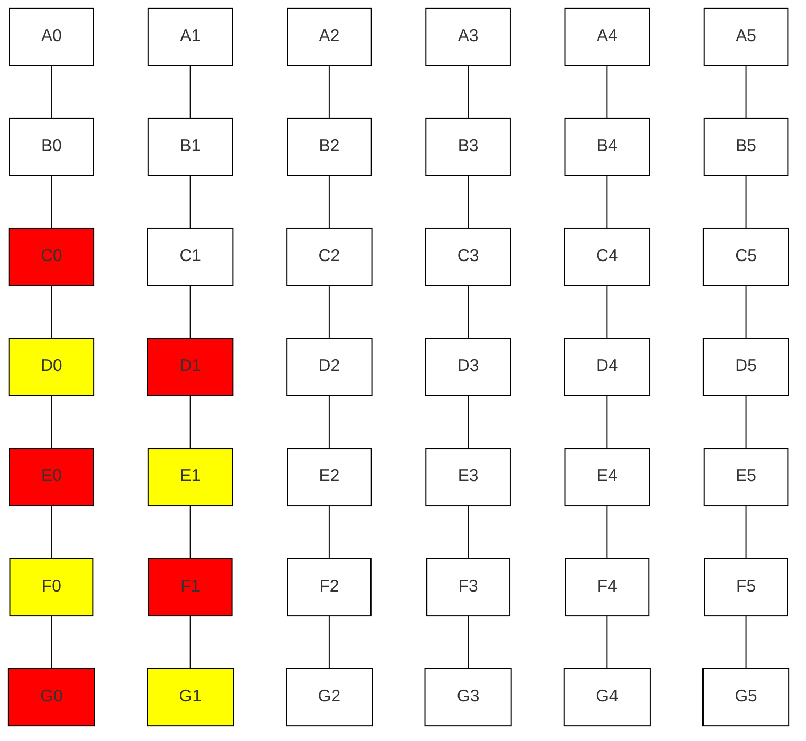

# Connect4

## Introduction

### Purpose
The aim is to develop an interactive version of the game which the candidate and interviewer
can play together.

A simple, text-based, representation of the grid is encouraged. For example, you might use '.' for empty slots, and 'x' and 'o' for pieces of the two players. Players can input their turns via the REPL, or you can implement a simple API.

A minimal version of the game should support:
- a 6 x 7 grid
- players play pieces sequentially
- the game identifies winning turns and ends at that point

### Scope
No UI.


## System Overview

Nb. First create the StateManager. Then create the Board, providing callback references to the StateManager functions, so that when a Counter enters a Slot in the Board, a callback is made to the StateManager with details of the change.


### System Context
Provides a high-level view of the system and its interactions with external entities (users, other systems).

Interactions
```
Process "Initialise game"
  Caused by `connect4 start` command
  Player 1 is instructed to take their turn by selecting a column
```

```
Process "Take turn"
  Caused by Next-turn event being raised by the StateManager
  Player 1/2 takes turn by inputting the Column number they wish to drop their Counter into
```

```
Process "End state reached"
  Caused by Game-won event being raised by StateManager
```

#### External Entities
Players: there will be two human players.

#### Assumptions and Constraints

##### Assumptions
- The game will be played on the same computer, with each Player taking it in turns to use the keyboard.
- Games do not need to be saved.

##### Constraints
- The Board will comprise a 6 x 7 grid of Slots
- players play pieces sequentially
- the game identifies winning turns and ends at that point
- there are enough Counters to fill every Slot in the Board

### Architecture Diagram
A visual representation of the system architecture, showing major components and their relationships.


## System Architecture

### Component Descriptions

#### Player
A Player may take a Counter from the remaining Counters and place it into any of the Columns of the Board.

#### Board
The Board is made up of Rows and Columns of Slots.



```
Board {
    rows: Row[]
    columns: Column[]
    
    dropCounter(column: number, counter: Counter)
}
```

#### Slot
A Slot is a single disk sized section of the Board. It can hold one Counter.

#### Counters
The set of all Counters.

#### Counter
A Counter is a coloured plastic disk which can fit into the Columns of the Board (at least in the physical game).

There are enough Counters to fill every Slot in the Board.

```
Colour: 'red' | 'yellow'

Counter {
    colour: Colour

    getColour(): Colour
}
```

#### State Manager
Checks to see if a winning state has occured.

Go through each Slot. If a Slot has a Counter in it then perform the following checks:
- Vertical line (ascending) check
- Vertical line (descending) check
- Horizontal line (left) check
- Horizontal line (ascending) check
- Diagonal line (ascending) check
- Diagonal line (descending) check

### Data Flow Diagrams (DFD)
Illustrates how data moves through the system.
### Use Case Diagrams
Depicts the interactions between users and the system.
### Use Case Diagrams
### Deployment Diagram
Shows how the software will be deployed across various hardware components or nodes.


## Design Considerations
### Assumptions
Lists assumptions made during the design process.
### Constraints
Identifies constraints that impact the design (e.g., hardware, software, regulatory).
### Dependencies
Highlights dependencies on other systems or components.
### Design Principles
Outlines the principles guiding the design (e.g., scalability, maintainability).


## Subsystems and Modules
### Subsystem Overview
Provides a high-level description of each subsystem and its role within the overall system.
### Module Descriptions
Detailed descriptions of each module within a subsystem, including their interfaces, functionality, and interconnections.


## Interface Design
### External Interfaces
Describes interfaces with external systems, including APIs, communication protocols, and data formats.
### Internal Interfaces
Details interfaces between internal components, specifying methods of interaction and data exchange.


## Data Design
### Data Model
Describes the data entities, relationships, and data flow within the system.
### Database Design
High-level description of the database schema, including tables, relationships, and key attributes.


## Security Considerations
### Security Architecture
Overview of the system's security features and mechanisms.
### Authentication and Authorization
Methods for ensuring secure access to the system.
### Data Protection
Measures for protecting sensitive data.


## Performance Considerations
### Performance Requirements
Expected performance metrics and benchmarks.
### Scalability Plan
Strategies for scaling the system to handle increased load.
### Optimization Techniques
Approaches for optimizing system performance.


## Error Handling and Logging
### Error Management
Strategies for detecting, reporting, and handling errors.
### Logging
Design of the logging mechanism for tracking system events and issues.


## Testing and Validation
### Testing Strategy
Overview of the testing approach, including types of testing to be performed (unit, integration, system).
### Validation Criteria
Criteria for validating that the system meets its requirements.


## Appendices
### Glossary
Definitions of terms and acronyms used in the document.
### References
List of references and sources used in the document.
Change Log: Record of changes made to the document over time.

