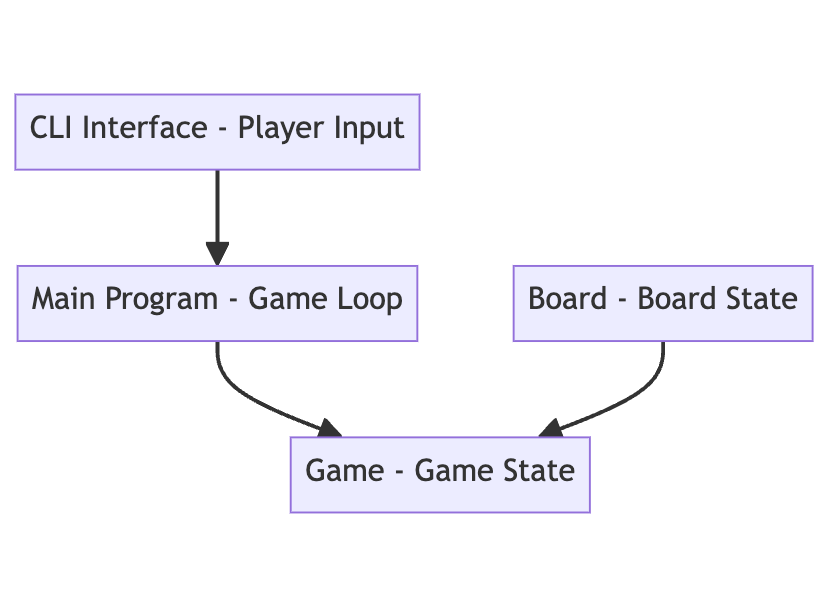

# Connect4

## Introduction

<div style="text-align: center;">
    
</div>

### Purpose
The aim is to develop an interactive version of the game which the candidate and interviewer
can play together.

A simple, text-based, representation of the grid is encouraged. For example, you might use '.' for empty slots, and 'x' and 'o' for pieces of the two players. Players can input their turns via the REPL, or you can implement a simple API.

A minimal version of the game should support:
- a 6 x 7 grid
- players play pieces sequentially
- the game identifies winning turns and ends at that point

### Scope
No UI.


## System Overview

### System Context
Provides a high-level view of the system and its interactions with external entities (users, other systems).

#### Domain Entities
```
type Player = {
  id: number
  name: string
  colour: string
}

type Board = {
  cells: (Player | null)[][]
  columnTokenCount: (column: number) => number
  findTokens: (direction: DIRECTION, colour: string, cell: [number, number]) => Array<[number, number]>
  print: (winningLine?: Array<[number, number]> | null) => void
}

type GameState = {
  board: Board
  players: Player[]
  currentPlayer: Player
  winner: Player | null
  winningLine: Array<[number, number]> | null
}
```

#### Workflow steps
```
type StartGame = (board: Board) => GameState
type ProcessGameTurn = Async (gameState: GameState) => Result<GameState>
type PlayerMove = Async (column: number) => Result<GameState, PlayerMoveError>
type CheckWinCondition = (gameState: GameState, column: number) => GameState
type SwitchTurns = (currentPlayer: Player, players: Player[]) => Player
type EndGame = (gameState: GameState) => void
```

#### Workflow
```
StartGameFn
 |> ProcessGameTurnFn
 |> EndGameFn

ProcessGameTurnFn
 |> CheckWinConditionFn
 |> PlayerMoveFn
 |> SwitchTurnsFn
 |> ProcessGameTurnFn
```


## System Architecture
<div style="text-align: center;">
    
</div>

### Component Descriptions

#### Player
A Player may take a Counter from the remaining Counters and place it into any of the Columns of the Board.

#### Board
The Board is made up of Rows and Columns of Slots.


#### Win state checks
At each go a "win check" will be executed. Taking the last placed token position and working out if a series of 4 tokens can be found by looking either side of it.

This middle-out function is quicker than looping through all the rows.

The different directions to check are:
- Vertical line (ascending)
- Vertical line (descending)
- Horizontal line (left)
- Horizontal line (ascending)
- Diagonal line (ascending)
- Diagonal line (descending)


## Design Considerations
### Assumptions
- The game will be played on the same computer, with each Player taking it in turns to use the keyboard.
- Games do not need to be saved.

### Constraints
- The Board will comprise a 6 x 7 grid of Slots
- players play pieces sequentially
- the game identifies winning turns and ends at that point
- there are enough Counters to fill every Slot in the Board

